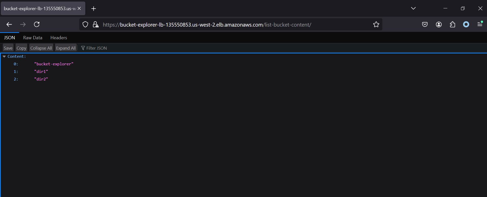
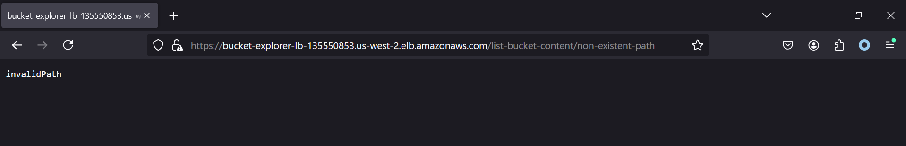
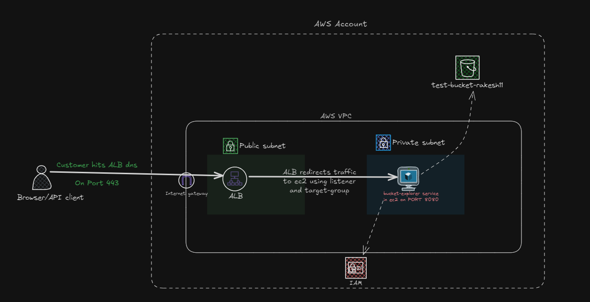
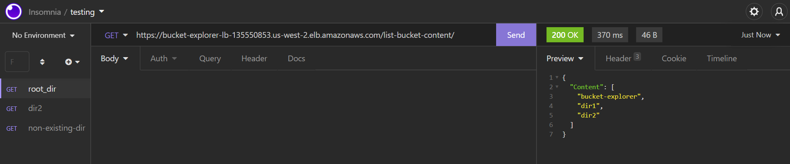
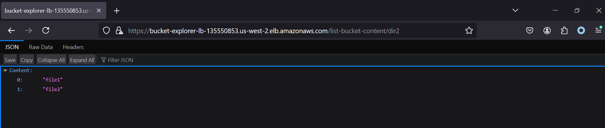
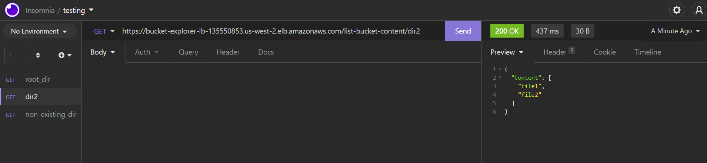
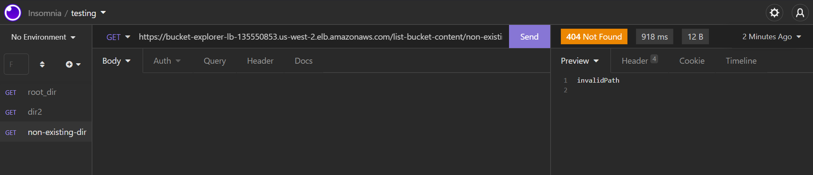

# Bucket Explorer (S3 Bucket Content Listing Service with https)

# Assumptions and Pre-context
1. Base infra(vpc, subnets, nat...etc) are assumed to be present already(I am using my exisiting vpc and other networking setup).
2. I have created one s3 bucket for testing my service from local machine so, I am making use of same in the stack aswell and not importing that to terraform.
3. service is built from the local machine and is being stored in an s3 bucket for convience, where ec2 will download and use if from.
4. I am re-using one of my existing cert and the arn is hardcoded into the terragrunt file and is not created.

## Table of Contents
- [Overview](#overview)
- [API Endpoints](#api-endpoints)
- [Error Handling](#error-handling)
- [Technology Stack](#technology-stack)
- [Terraform Infrastructure](#terraform-infrastructure)
- [Architecture Diagram](#architecture-diagram)
- [Testing](#testing)
- [Local Setup](#local-setup)
- [Images of complete AWS setup](#images-of-complete-aws-setup)
 
## Overview
This project implements an HTTP service that exposes an endpoint to list the contents of an S3 bucket. The service returns a JSON response containing directory and file names based on the provided path. The project is built using Go (Golang) and is deployed on AWS.
 
## API Endpoints
 
### List Bucket Content
- **GET** `http://<IP>:<PORT>/list-bucket-content/<path>`
  - Returns the contents of the specified S3 bucket path.
  - If no path is specified, it returns the top-level content.
 
#### Examples:
- **Request**: `http://<IP>:<PORT>/list-bucket-content/`
  - **Response**: 
    ```json
    {
      "content": ["dir1", "dir2"]
    }
    ```
    
 
- **Request**: `http://<IP>:<PORT>/list-bucket-content/dir2`
  - **Response**:
    ```json
    {
      "content": ["file1", "file2"]
    }
    ```

 
### Error Handling
The service handles errors gracefully, returning appropriate HTTP status codes and messages for non-existing paths.
 
- **404 Not Found** for non-existing paths.
- **500 Internal Server Error** for unexpected server issues.

##### Example:
- **Request**: `http://<IP>:<PORT>/list-bucket-content/non-existent-path`
  - **Response**:
    ```
    invalidPath
    ```
    
 
## Technology Stack
- **Programming Language**: Go (Golang)
- **HTTP Library**: Standard `net/http` package in Go
- **AWS Services**: EC2, Security Group, Application Load Balancer, Listener, Target Group, S3, IAM
- **Terraform**: Infrastructure as code for provisioning
- **Terragrunt**: Wrapper to provide inputs for terraform
 
## Terraform Infrastructure

#### Folder Struct
```
├───infra
    ├───terraform-modules 
    │   ├───aws_instance
    │   ├───aws_lb
    │   ├───aws_security_group
    │   ├───iam_role
    │   ├───listener_complete
    │   └───target_group_complete
    └───<account-name>
        └───us-west-2
            └───dev
            └───bucket-explorer
                    ├───ec2
                    ├───lb
                    ├───iam
                    ├───listener
                    ├───security-group
                    ├───target-group

```


1. **[terraform-modules](./infra/terraform-modules/)**: This directory contains all the Terraform modules used to create the infrastructure. Typically, this will be found in a separate repository and used across projects.
2. **`<account-name>`**: This folder houses all the Terragrunt files related to the infrastructure.
3. **[bucket-explorer](./infra/account-name/us-west-2/dev/bucket-explorer/)**: This folder contains all the `terragrunt.hcl` files used for providing inputs. The name `bucket-explorer` refers to my microservice.

> **Note**: In the committed data, some fields from **[environment.hcl](./infra/account-name/us-west-2/dev/environment.hcl)** have been removed, and null values have been placed instead.

## Architecture Diagram



> **Note**: Components such as Listener, Target Group, ACM, and Security Groups are not included in this diagram.

## Testing

1. Root Directory



1. dir2



1. Non-Existing Directory



## Local Setup
To build this service in your local machine use the `Makefile`.
1. Install [make](https://gnuwin32.sourceforge.net/packages/make.htm)
1. To build and run
```
>make build
>make run
```
1. To delete/clean
```
>make clean
```

## Images of complete AWS Setup
Refer [images](./docs/images/) folder for detailed AWS components images
